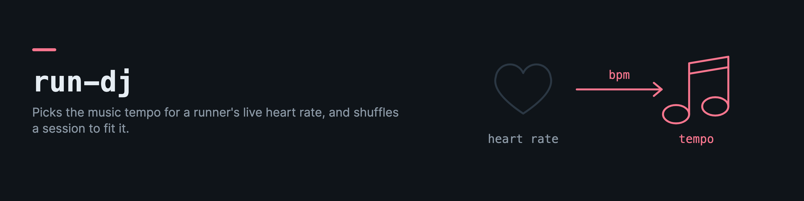

# run-dj

HR → music BPM mapping + session shuffle engine.

`run-dj` is the pure-logic core extracted from [Soma](https://github.com/drkostas/soma)'s live DJ daemon: given a runner's live heart rate, it computes the target music BPM for that effort, and given a candidate pool of songs it produces a session-aware shuffle that spreads same-artist songs evenly without clustering.

No I/O, no database, no network. Just math and state transitions — so the same logic works in a Garmin-driven treadmill session, a Spotify playlist builder, or anything else that wants "pick the right tempo for this pulse."

## What it computes

### BPM formula
- **Piecewise anchors** between 0% HRR (75 BPM) and 100% HRR (175 BPM), linearly interpolated.
- **Whole-BPM output**: the interpolated value is rounded to the nearest BPM (Python-style rounding, kept for parity with the goldens), then clamped.
- Floor 70, ceiling 185.
- Research basis: Karageorghis et al. (2009, 2011) on HR-preference scaling; CADENCE-Adults (Bravata et al.) on piecewise HR-cadence.

### Session shuffle
- Tracks `played`, `skipped`, and `lastPlayedArtistId` per session.
- Partitions candidates by artist, then interleaves to maximize artist diversity.
- Feels more random to humans than Fisher-Yates because it prevents the birthday-paradox clustering effect.

### Genre buckets, ReccoBeats, Spotify

`toMacroGenres(microGenres)` folds Spotify's micro-genres into the DJ's ten buckets. `fetchAudioFeatures(ids, { fetchImpl?, sleep? })` reads tempo, energy, valence and friends from ReccoBeats in batches of 40 with 429 back-off. `createSpotifyClient({ clientId, store })` is the Web API client with a cached token, refresh on expiry and one retry on 401; the consumer supplies a `SpotifyTokenStore` (where the tokens live is its business) and can inject `fetch` and the clock for tests.

## Install

The same pure core is also published to npm (source in [`typescript/`](typescript/)) so it can run
in the browser, Node, or a Vercel cron alongside Soma's TypeScript stack.
The Python original this was ported from was removed on 2026-09-11 (git history keeps it); the npm package is the product. Its tests carry the Python-parity goldens.

```bash
npm install run-dj
```

```ts
import { hrrToBpm, SessionState, interleavedShuffle, selectSongsForSegment } from "run-dj";

const bpm = hrrToBpm(125, 60, 190); // → 128
const state = new SessionState();
const ordered = interleavedShuffle(candidateSongs, state);
```

The TS package also exposes the segment-based playlist scorer (`bpmQuality`,
`qualityScore`, `selectSongsForSegment`). CI runs the vitest suite on every push, including the
891-case BPM golden and the round-half-even parity cases that came from the Python original.

## The live DJ's decision and run segments

`cycle` (also `run-dj/cycle`) is the live DJ's decision core: `decideQueue` says whether to queue the next track and why, `bpmSearchTargets` gives the tempos a track search should cover (the target plus half and double tempo), and `selectNextTrack` picks from the candidates.

`segments` (also `run-dj/segments`, since 0.6.0) is the segment model a run playlist is built against: segment types with their BPM and valence ranges, parsed workout steps to segments and repeat groups, and `segsForGenerate`, which decides which segments share a pool of songs. Ids come from the caller.

Changes are listed in [the CHANGELOG](https://github.com/drkostas/run-dj/blob/main/typescript/CHANGELOG.md).

## License

MIT.
